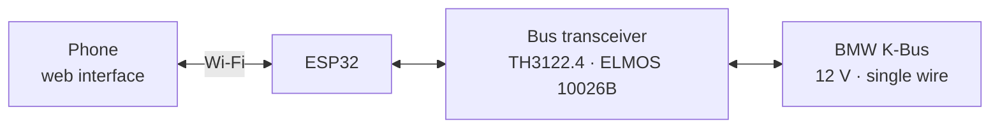
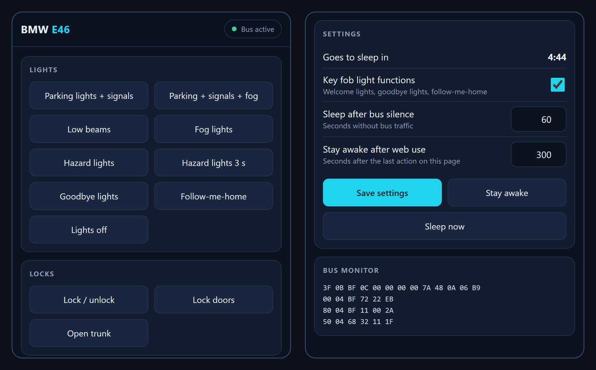
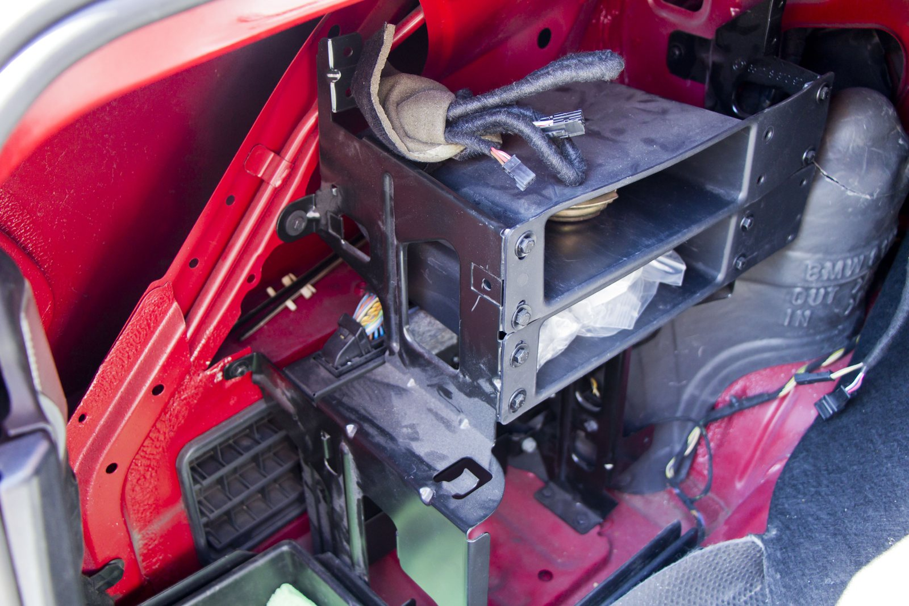
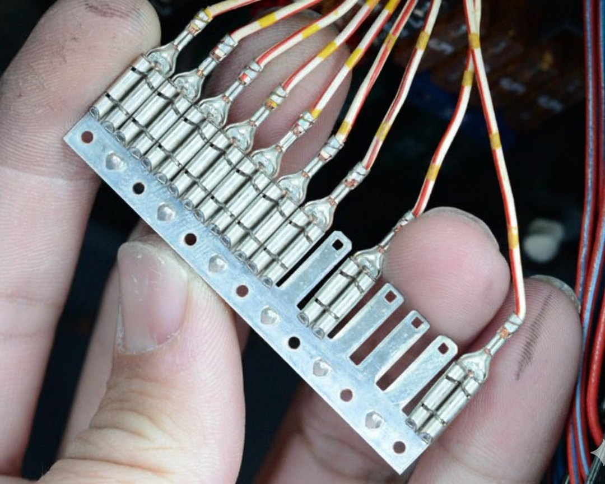

<div align="center">



# BMW I-Bus / K-Bus Firmware for ESP32 & Arduino

**Control your classic BMW from your phone.**<br>
Ready-to-flash ESP32 firmware that puts the lights, windows, locks and trunk of your car on a web page — no app and no internet needed. An Arduino Nano version without Wi-Fi is included too. With transceiver schematics and wiring photos for the BMW E46.

[](https://github.com/muki01/BMW_IBus_KBus/stargazers)
[](https://github.com/muki01/BMW_IBus_KBus/forks)
[](https://github.com/muki01/BMW_IBus_KBus/issues)
[](LICENSE)
[](https://github.com/muki01/BMW_IBus_KBus/commits/main)


[Features](#-features) ·
[Quick Start](#-quick-start) ·
[Web Interface](#-esp32-web-interface) ·
[Hardware](#-hardware) ·
[Where to Connect](#-where-to-connect-bmw-e46) ·
[Messages](#-message-reference) ·
[FAQ](#-faq)

</div>

---

## 🌟 What Is This?

Classic BMWs link their body electronics over a single wire, the **K-Bus**. A small microcontroller on that wire can tell the light module, the body module and the windows what to do.

This repository is the **firmware** side of that idea: complete sketches you upload, connect and use. The ESP32 version creates its own Wi-Fi network and lets you control the car from a web page on your phone.

| Firmware | Board | What it does |
| :-- | :-- | :-- |
| [`E46_KBus_ESP32`](Codes/E46_KBus_ESP32) | ESP32 | Wi-Fi web interface to control the car from your phone. |
| [`E46_KBus_Code`](Codes/E46_KBus_Code) | Arduino Nano / Uno | The Nano has no Wi-Fi, so this version works from the remote key: welcome lights, goodbye lights and follow-me-home. |
| [`Basic_Code`](Codes/Basic_Code) | Arduino Nano / Uno | Bus reader that prints every message — useful to check your wiring. |

> [!IMPORTANT]
> **These sketches need the [BMW IBus KBus library](https://github.com/muki01/BMW_IBus_KBus_Library).** It handles the bus communication — receiving, checksums and collision-free transmitting — and has to be installed before the sketches compile.



## ✨ Features

| | Function | How it works |
| :-: | :-- | :-- |
| 📱 | **Phone control** | Lights, locks, trunk, windows, sunroof, interior light and wipers from any phone browser — no app, no internet. |
| 🎚️ | **Settings on the page** | Change the sleep timers and switch functions on or off; everything is stored on the ESP32. |
| 🔎 | **Bus monitor** | See the latest bus messages live in the web interface. |
| 💤 | **Sleep mode** | Powers down when the bus goes quiet and wakes up with the car, so it does not drain the battery. |

The **Arduino Nano** has no Wi-Fi, so its firmware is driven by the remote key instead:

| | Function | How it works |
| :-: | :-- | :-- |
| 💡 | **Welcome lights** | Press *unlock* — parking lights and turn signals come on. Press *unlock* again within about 15 seconds to add the fog lights. |
| 👋 | **Goodbye lights** | Press *lock* — the lights come on for 2 seconds as you walk away. |
| 🏠 | **Follow-me-home** | With the car locked, press *lock* twice within 4 seconds to keep the headlights on. |

The ESP32 firmware includes these three as well; they can be switched off in the web interface.

## 🚀 Quick Start

**1. Build the interface** — the [transceiver circuit](#-hardware) connects the microcontroller to the 12 V bus.

**2. Tap the bus** — the [CD-changer connector](#-where-to-connect-bmw-e46) in the trunk gives you 12 V, ground and K-Bus in one plug.

**3. Install the library** — download the [BMW IBus KBus library](https://github.com/muki01/BMW_IBus_KBus_Library) as a ZIP and add it in the Arduino IDE with **Sketch → Include Library → Add .ZIP Library…**

**4. Get the firmware** and open the sketch for your board in the Arduino IDE:

```bash
git clone https://github.com/muki01/BMW_IBus_KBus.git
```

**5. Upload.**

- **ESP32** — open `Codes/E46_KBus_ESP32`, set your own Wi-Fi password in [`Config.h`](Codes/E46_KBus_ESP32/Config.h), select **ESP32 Dev Module** and upload. Then connect your phone to the `BMW-E46` network and open **http://192.168.4.1**
- **Arduino Nano / Uno** — open `Codes/E46_KBus_Code`, select your board and upload. Disconnect the transceiver from D0 / D1 while uploading; the bus shares the hardware UART with USB.

## 📱 ESP32 Web Interface



The ESP32 creates its own Wi-Fi network and serves a single page — it works without internet and without an app.

- **Controls** — every button sends one message from [`E46_Codes.h`](Codes/E46_KBus_ESP32/E46_Codes.h). The buttons are defined in [`Commands.h`](Codes/E46_KBus_ESP32/Commands.h); add, remove or reorder a line to change the page.
- **Settings** — switch the key-fob light functions on or off and adjust both sleep timers. Settings are stored in flash.
- **Bus monitor** — the last 20 messages on the bus, newest first.

### How sleep works

| Situation | Behaviour |
| :-- | :-- |
| The bus is active | The ESP32 stays awake. |
| The bus has been silent for **60 s** | The ESP32 switches off Wi-Fi, puts the transceiver to sleep and enters deep sleep. |
| You used the web interface | It stays awake for another **300 s** after your last action, even if the bus is silent. |
| Any message appears on the bus | The transceiver signals the ESP32 and it wakes up — for example when you press the remote key. |

Both times can be changed in the web interface. The page shows a countdown to the next sleep and has **Stay awake** and **Sleep now** buttons.

> [!WARNING]
> Anyone who can join the Wi-Fi network can unlock the car. The firmware therefore has **no default password** and does not compile until you set your own in `Config.h`. Choose a strong one.

> [!NOTE]
> The ESP32 firmware is **experimental**: it compiles on Arduino-ESP32 2.x and 3.x and the web interface has been tested in a browser, but it has not yet been verified in a vehicle.

## 🔧 Hardware

The bus idles at battery voltage, so a microcontroller must **never** be wired to it directly. The firmware is designed around the **TH3122.4 / ELMOS 10026B** bus transceiver:


| Transceiver pin | Arduino Nano / Uno | ESP32 | Purpose |
| :-- | :-- | :-- | :-- |
| TXD | `D0` (RX) | `GPIO16` | Bus → microcontroller |
| RXD | `D1` (TX) | `GPIO17` | Microcontroller → bus |
| SEN/STA | `D3` | `GPIO4` | Bus-idle detection; wakes the ESP32 from deep sleep |
| EN | `D4` | `GPIO5` | Transceiver enable / sleep |
| — | `D13` | `GPIO2` | Bus activity LED |
| — | `D7` / `D8` | USB | Debug output |

**Arduino Nano / Uno** — powered from the transceiver's 5 V output. When the bus goes quiet the firmware pulls EN low, the transceiver switches its regulator off and the Arduino powers down with it. Bus activity wakes both again.

**ESP32** — keep these three points in mind:

- **Power:** give the ESP32 its own 12 V → 5 V regulator; Wi-Fi draws more current than the transceiver's regulator is meant to supply.
- **Logic level:** the transceiver uses 5 V logic and ESP32 pins are 3.3 V. Use a level shifter or voltage divider on the signals going into the ESP32 (TXD and SEN/STA).
- **Wake-up pin:** SEN/STA must be connected to an RTC-capable GPIO (0, 2, 4, 12–15, 25–27, 32–39). The pins are set in [`Config.h`](Codes/E46_KBus_ESP32/Config.h).

<details>
<summary><b>Alternative interface circuits</b></summary>

<br>

**Optocouplers (PC817)** — built from common parts; well suited to reading the bus.


**MCP2025 LIN transceiver** — compact, with a built-in voltage regulator.


These circuits have no SEN/STA and EN pins, so the firmware's collision avoidance and sleep mode are not available with them.

</details>

## 🔌 Where to Connect (BMW E46)

The K-Bus is **not** available on the OBD-II port. These are the most practical places to reach it:

### Option 1 — CD-changer connector (easiest)

Pre-wired in the trunk on most cars, even when no CD changer is installed. One plug provides everything you need.

<table>
  <tr>
    <td width="33%"></td>
    <td width="33%"></td>
    <td width="33%"></td>
  </tr>
  <tr>
    <td align="center"><b>1.</b> Open the trunk — driver's side</td>
    <td align="center"><b>2.</b> Remove the trim to reach the bracket</td>
    <td align="center"><b>3.</b> The 3-pin connector <b>X18180</b></td>
  </tr>
</table>

| Wire colour | Signal |
| :-- | :-- |
| ⚪🔴🟡 White / red with yellow dots | **K-Bus** |
| 🔴🟢 Red / green | **+12 V** |
| 🟤 Brown | **Ground** |

### Option 2 — K-Bus junction block (above the fuse box)

The central splice point where every K-Bus branch of the car meets. Take the bus signal here and source 12 V and ground elsewhere.

<table>
  <tr>
    <td width="50%"></td>
    <td width="50%"></td>
  </tr>
  <tr>
    <td align="center"><b>1.</b> Locate the connector block above the fuse box</td>
    <td align="center"><b>2.</b> Unclip it and pull it out</td>
  </tr>
  <tr>
    <td></td>
    <td></td>
  </tr>
  <tr>
    <td align="center"><b>3.</b> Find the K-Bus junction block</td>
    <td align="center"><b>4.</b> All white / red / yellow wires are K-Bus</td>
  </tr>
</table>

### Option 3 — Radio connector

The K-Bus wire (white / red / yellow) is also present in the radio harness behind the head unit.

## 📖 Message Reference

[`E46_Codes.h`](Codes/E46_KBus_Code/E46_Codes.h) contains more than 100 ready-to-send messages for the E46. A selection is shown here with its checksum. Behaviour varies between models and equipment levels, so verify each one on your own car.

<details open>
<summary><b>Events the firmware can react to</b></summary>

| Message | Meaning |
| :-- | :-- |
| `00 04 BF 72 22 EB` | Key fob — unlock pressed |
| `00 04 BF 72 12 DB` | Key fob — lock pressed |
| `44 05 BF 74 04 00 8E` | Key inserted |
| `44 05 BF 74 00 FF 75` | Key removed |
| `80 04 BF 11 00 2A` | Ignition off |
| `80 04 BF 11 01 2B` | Ignition position 1 |
| `80 04 BF 11 03 29` | Ignition position 2 |
| `50 04 68 32 11 1F` | Steering wheel — volume up |
| `50 04 68 32 10 1E` | Steering wheel — volume down |
| `50 04 68 3B 02 05` | Steering wheel — R/T button |

</details>

<details>
<summary><b>Lights</b></summary>

| Message | Action |
| :-- | :-- |
| `3F 0B BF 0C 00 00 00 00 7A 48 0A 06 B9` | Parking lights + turn signals |
| `3F 0B BF 0C 00 00 00 00 7A 48 0B 06 B8` | Parking lights + turn signals + fog lights |
| `3F 0B BF 0C 00 00 00 00 02 4E 0A 06 C7` | Low beams |
| `3F 0B BF 0C 00 00 00 00 62 08 A0 06 4B` | Goodbye lights |
| `3F 0B BF 0C 00 00 80 00 00 00 00 06 01` | Follow-me-home |
| `3F 0B BF 0C 00 00 00 00 00 00 01 06 80` | Fog lights |
| `3F 0B BF 0C 20 00 00 00 00 00 00 06 A1` | Hazard lights |
| `3F 05 00 0C 75 01 42` | Hazard lights for 3 seconds |
| `3F 05 00 0C 01 01 36` | Interior light on |

</details>

<details>
<summary><b>Windows, sunroof, locks and wipers</b></summary>

| Message | Action |
| :-- | :-- |
| `3F 05 00 0C 52 01 65` | Driver window — open |
| `3F 05 00 0C 53 01 64` | Driver window — close |
| `3F 05 00 0C 54 01 63` | Front passenger window — open |
| `3F 05 00 0C 55 01 62` | Front passenger window — close |
| `3F 05 00 0C 7E 01 49` | Sunroof — open |
| `3F 05 00 0C 7F 01 48` | Sunroof — close |
| `3F 05 00 0C 03 01 34` | Central locking — toggle |
| `3F 05 00 0C 34 01 03` | Lock doors |
| `3F 05 00 0C 02 01 35` | Open trunk |
| `3F 05 00 0C 49 01 7E` | Front wipers |
| `3F 05 00 0C 62 01 55` | Front washer |
| `3F 05 00 0C 4E 01 79` | Alarm LED ("clown nose") for 3 seconds |

</details>

Want to write your own functions? The message format, the API and the module address list are documented in the [library repository](https://github.com/muki01/BMW_IBus_KBus_Library).

## 📡 Supported Models

The firmware and message table were written for the **BMW E46**. The K-Bus itself is shared by many models, so the hardware and the library also work on the cars below — the messages may differ and need to be verified.

| Chassis | Series | Years | I-Bus | K-Bus |
| :-- | :-- | :-- | :-: | :-: |
| **E46** | 3 Series | 1997–2006 | | ✅ |
| **E38** | 7 Series | 1994–2001 | ✅ | ✅ |
| **E39** | 5 Series | 1995–2004 | ✅ | ✅ |
| **E53** | X5 | 1999–2006 | ✅ | ✅ |
| **E83** | X3 | 2003–2010 | | ✅ |
| **E85** | Z4 | 2002–2008 | | ✅ |

## 📁 Repository Structure

```text
BMW_IBus_KBus/
├── Codes/
│   ├── E46_KBus_ESP32/      ESP32 firmware: web interface for your phone
│   ├── E46_KBus_Code/       Arduino firmware: light functions from the remote key
│   └── Basic_Code/          Bus reader for checking the wiring
├── Schematics/              Transceiver circuits
└── Pictures/                Wiring photo guides
```

The bus communication code lives in its own repository: **[BMW_IBus_KBus_Library](https://github.com/muki01/BMW_IBus_KBus_Library)**.

## ❓ FAQ

<details>
<summary><b>Can I connect to the OBD-II port instead?</b></summary>

No. The K-Bus is the car's internal body network and is not present on the OBD-II connector. The line on the OBD-II port is the diagnostic <b>K-Line</b> — for that, see <a href="https://github.com/muki01/OBD2_K-line_Reader">OBD2 K-line Reader</a>.
</details>

<details>
<summary><b>Will it drain my battery?</b></summary>

Both versions sleep when the bus is quiet and wake up with the car. The Arduino is switched off completely by the transceiver. The ESP32 uses deep sleep; a bare module draws microamps in that state, while a development board with a USB bridge and power LED draws a few milliamps.
</details>

<details>
<summary><b>Why is there no default Wi-Fi password on the ESP32?</b></summary>

Because the web interface can unlock the car. A password that is published in a repository would let anyone nearby open every car running this firmware, so you have to choose your own before the sketch compiles.
</details>

<details>
<summary><b>Does it work on other BMWs?</b></summary>

The hardware and the library work on any car with an I-Bus or K-Bus. The messages in this repository were collected on an E46 and should be checked on other chassis before you rely on them.
</details>

<details>
<summary><b>How do I add my own button to the web interface?</b></summary>

Add one line to <code>Commands.h</code> with the group, the button text and the name of a message from <code>E46_Codes.h</code>. The page is built from that list.
</details>

## 🤝 Contributing

Contributions are welcome — especially:

- Test reports for the ESP32 firmware
- Verified messages for other chassis (E38, E39, E53, E83, E85)
- Wiring photos and connection points for other models

Open an [issue](https://github.com/muki01/BMW_IBus_KBus/issues) to discuss an idea, or send a pull request.

## 🔗 Related Projects

Part of a complete automotive communication and diagnostics ecosystem:

| Firmware & Readers | Libraries | Manufacturer Protocols | UI |
| :-- | :-- | :-- | :-- |
| [OBD2 K-line Reader](https://github.com/muki01/OBD2_K-line_Reader) | [OBD2 K-Line Library](https://github.com/muki01/OBD2_KLine_Library) | [BMW I/K Bus](https://github.com/muki01/BMW_IBus_KBus) | [OBD2 Diagnostic UI](https://github.com/muki01/OBD2-Diagnostic-UI) |
| [OBD2 CAN Bus Reader](https://github.com/muki01/OBD2_CAN_Bus_Reader) | [OBD2 CAN Bus Library](https://github.com/muki01/OBD2_CAN_Bus_Library) | [VAG KW1281](https://github.com/muki01/VAG_KW1281) | |
| | [BMW IBus KBus Library](https://github.com/muki01/BMW_IBus_KBus_Library) | | |

## 💼 Custom Development

I design automotive diagnostic tools, firmware and apps professionally. If you need a complete product or only the communication layer, I can help with:

- **Protocol implementation** — BMW I/K-Bus, K-Line (ISO 9141-2 / KWP2000), CAN bus, VAG KW1281 and other manufacturer-specific protocols
- **ECU communication and reverse engineering** — bus sniffing, packet decoding, module control, undocumented buses
- **ECU security access** — seed-key algorithms and unlock routines for KWP2000 / UDS
- **Embedded firmware** — Arduino, ESP32, ESP8266, STM32, Raspberry Pi Pico
- **Custom hardware** — diagnostic shields and PCBs designed to your requirements
- **Companion apps** — Android, iOS and web apps to visualise, log and control your device

📧 **[muksin.muksin04@gmail.com](mailto:muksin.muksin04@gmail.com)**

## ☕ Support the Project

If this project saved you time, consider supporting its development:

[](https://www.buymeacoffee.com/muki01)
[](https://www.paypal.com/donate/?hosted_button_id=SAAH5GHAH6T72)
[](https://github.com/sponsors/muki01)

## ⚠️ Disclaimer

> [!WARNING]
> This is a hobby and development project. Transmitting on a live vehicle bus can affect lighting, locking and other body functions. Test with the vehicle stationary, proceed at your own risk, and never operate the system in a way that distracts from driving. The author accepts no responsibility for damage or malfunction.

BMW is a registered trademark of BMW AG. This project is independent and is not affiliated with, endorsed by or sponsored by BMW AG.

## 📄 License

Released under the [MIT License](LICENSE).

---

<div align="center">

Created by [**Muki**](https://github.com/muki01) · If this project helped you, please give it a ⭐

</div>
